======================================================================================================

bayesDP
=======

### Tools for the Bayesian Discount Prior Function

<https://cran.r-project.org/package=bayesDP>

### Description

Functions for data augmentation using the Bayesian discount prior
function for 1 arm and 2 arm clinical trials.

### CRAN Installation

Install release version from CRAN:

    install.packages("bayesDP")

### GitHub Installation

Install development version from GitHub:

    devtools::install_github("balcomes/bayesDP")

### Documentation

See manuals and vignettes within package.

### Examples

See manuals and vignettes within package.

Introduction
============

The purpose of this vignette is to introduce the `bdpnormal` function.
`bdpnormal` is used for estimating posterior samples from a Gaussian
mean outcome for clinical trials where an informative prior is used. In
the parlance of clinical trials, the informative prior is derived from
historical data. The weight given to the historical data is determined
using what we refer to as a discount function. There are three steps in
carrying out estimation:

1.  Estimation of the historical data weight, denoted ,
    via the discount function

2.  Estimation of the posterior distribution of the current data,
    conditional on the historical data weighted by $\\hat{\\alpha}$

3.  If a two-arm clinical trial, estimation of the posterior treatment
    effect, i.e., treatment versus control

Throughout this vignette, we use the terms `current`, `historical`,
`treatment`, and `control`. These terms are used because the model was
envisioned in the context of clinical trials where historical data may
be present. Because of this terminology, there are 4 potential sources
of data:

1.  Current treatment data: treatment data from a current study

2.  Current control data: control (or other treatment) data from a
    current study

3.  Historical control data: treatment data from a previous study

4.  Historical control data: control (or other treatment) data from a
    previous study

If only treatment data is input, the function considers the analysis a
one-arm trial. If treatment data + control data is input, then it is
considered a two-arm trial.

Estimation of the historical data weight
----------------------------------------

In the first estimation step, the historical data weight
 is estimated. In the case of a two-arm trial, where
both treatment and control data are available, an  value
is estimated separately for each of the treatment and control arms. Of
course, historical treatment or historical control data must be present,
otherwise  is not estimated for the corresponding arm.

When historical data are available, estimation of  is
carried out as follows. Let , *s**t*, and
*N**t* denote the sample mean, sample standard deviation, and
sample size of the current data, respectively. Similarly, let
, *s*0*t*, and *N*0*t* denote the
sample mean, sample standard deviation, and sample size of the
historical data, respectively. Then, the posterior distribution of the
mean for current data, under vague (flat) priors is

Similarly, the posterior distribution of the mean for historical data,
under vague (flat) priors is

We next compute the posterior probability
. Finally, for a
Weibull distribution function (i.e., the Weibull cumulative distribution
function), denoted *W*,  is computed as

 where *w**s**h**a**p**e* and *w**s**c**a**l**e*
are the shape and scale of the Weibull distribution function,
respectively.

There are several model inputs at this first stage. First, the user can
select `fix_alpha=TRUE` and force a fixed value of  (at
the `alpha_max` input), as opposed to estimation via the discount
function. Next, a Markov Chain Monte Carlo approach is used, requiring
several samples from the posterior distributions. Thus, the user can
input a sample size greater than or less than the default value of
`number_mcmc=10000`. Finally, the shape of the Weibull discount function
can be altered by changing the Weibull shape and scale parameters from
the default values of *w**s**h**a**p**e* = 3 and
*w**s**c**a**l**e* = 0.135 (`weibull_shape` and
`weibull_scale` inputs).

With the historical data weight  in hand, we can move on
to estimation of the posterior distribution of the current data.

### Discount function

Throughout this vignette, we refer to a discount function. The discount
function is a Weibull distribution function and has the form
*W*(*x*)=1 − exp{−(*x*/*w**s**c**a**l**e*)*w**s**h**a**p**e*}.
 During estimation, a user may be interested in selecting values of
*w**s**h**a**p**e* and *w**s**c**a**l**e* that
result in optimal statistical properties of the analysis. Thus, the
discount function can be used to control the false positive rate (type I
error) and/or the false negative rate (type II error). Examples in a
following section illustrate the shape of the discount function using
the default shape and scale parameters.

Another important aspect related to the discount function is the
analysis type: one-sided or two-sided. The sidedness of the analysis is
analogous to a one- or two-sided hypothesis test. Using the default
shape and scale inputs, a **two-sided** analysis type results in a
discount function with the following curve:

The discount function of a **one-sided** analysis, again with the
default shape and scale inputs, has the following curve:

In both of the above plots, the x-axis is the stochastic comparison
between current and historical data, which we've denoted *p*. The y-axis
is the discount value  that corresponds to a given value
of *p*.

Estimation of the posterior distribution of the current data, conditional on the historical data
------------------------------------------------------------------------------------------------

With  in hand, we can now estimate the posterior
distribution of the mean of the current data. Using the notation of the
previous section, the posterior distribution is

 At this model stage, we have in hand `number_mcmc` simulations from the
augmented mean distribution. If there are no control data, i.e., a
one-arm trial, then the modeling stops and we generate summaries of the
posterior distribution of *μ*. Otherwise, if there are control data, we
proceed to a third step and compute a comparison between treatment and
control data.

Estimation of the posterior treatment effect: treatment versus control
----------------------------------------------------------------------

This step of the model is carried out on-the-fly using the `summary` or
`print` methods. Let *μ**T* and *μ**C* denote
posterior mean estimates of the treatment and control arms,
respectively. Currently, the implemented comparison between treatment
and control is the difference, i.e., summary statistics related to the
posterior difference: *μ**T* − *μ**C*. In a future
release, we may consider implementing additional comparison types.

Function inputs
---------------

The data inputs for `bdpnormal` are `mu_t`, `sigma_t`, `N_t`, `mu0_t`,
`sigma0_t`, `N0_t`, `mu_c`, `sigma_c`, `N_c`, `mu0_c`, `sigma0_c`, and
`N0_c`. The data must be input as (`mu`, `sigma`, `N`) triplets For
example, `mu_t`, the sample mean of the current treatment group, must be
accompanied by `sigma_t` and `N_t`, the sample standard deviation and
sample size, respectively. Historical data inputs are not necessary, but
using this function would not be necessary either.

**At the minimum, `mu_t`, `sigma_t`, and `N_t` must be input**. In the
case that only `mu_t`, `sigma_t`, and `N_t` are input, the analysis is
analogous to a one-sample t-test.. Each of the following input
combinations are allowed:

-   (`mu_t`, `sigma_t`, `N_t`) - one-arm trial
-   (`mu_t`, `sigma_t`, `N_t`) + (`mu0_t`, `sigma0_t`, `N0_t`) - one-arm
    trial
-   (`mu_t`, `sigma_t`, `N_t`) + (`mu_c`, `sigma_c`, `N_c`) - two-arm
    trial
-   (`mu_t`, `sigma_t`, `N_t`) + (`mu0_c`, `sigma0_c`, `N0_c`) - two-arm
    trial
-   (`mu_t`, `sigma_t`, `N_t`) + (`mu0_t`, `sigma0_t`, `N0_t`) +
    (`mu_c`, `sigma_c`, `N_c`) - two-arm trial
-   (`mu_t`, `sigma_t`, `N_t`) + (`mu0_t`, `sigma0_t`, `N0_t`) +
    (`mu0_c`, `sigma0_c`, `N0_c`) - two-arm trial
-   (`mu_t`, `sigma_t`, `N_t`) + (`mu0_t`, `sigma0_t`, `N0_t`) +
    (`mu_c`, `sigma_c`, `N_c`) + (`mu0_c`, `sigma0_c`, `N0_c`) - two-arm
    trial

Examples
========

One-arm trial
-------------

Suppose we have historical data with a mean of `mu0_t=50`, standard
deviation of `sigma0_t=5`, and sample size of `N0_t=250` patients. Also
suppose that we have current data with a mean of `mu_t=30`, standard
deviation of `sigma_t=10`, and sample size of `N_t=250`. To illustrate
the approach, let's first give full weight to the historical data. This
is accomplished by setting `alpha_max=1` and `fix_alpha=TRUE` as
follows:

    set.seed(42)
    fit1 <- bdpnormal(mu_t      = 30,
                      sigma_t   = 10,
                      N_t       = 250, 
                      mu0_t     = 50,
                      sigma0_t  = 5,
                      N0_t      = 250,
                      alpha_max = 1,
                      fix_alpha = TRUE)
    summary(fit1)

    ## 
    ##     One-armed bdp normal
    ## 
    ## data:
    ##   Current treatment: mu_t = 30, sigma_t = 10, N_t = 250
    ##   Historical treatment: mu0_t = 50, sigma0_t = 5, N0_t = 250
    ## Stochastic comparison (p_hat) - treatment (current vs. historical data): 1
    ## Discount function value (alpha) - treatment: 1
    ## 95 percent confidence interval: 
    ##  44.985  46.922
    ## augmented sample estimate:
    ## mean of treatment group
    ##  45.9982

Based on the `summary` output of `fit1`, we can see that the value of
`alpha` was held fixed at 1. The resulting (augmented) mean was
estimated at 45.9982. Note that the `print` and `summary` methods result
in the same output.

Now, let's relax the constraint on fixing `alpha` at 1. We'll also take
this opportunity to describe the output of the plot method.

    set.seed(42)
    fit1a <- bdpnormal(mu_t     = 30,
                       sigma_t   = 10,
                       N_t       = 250, 
                       mu0_t     = 50,
                       sigma0_t  = 5,
                       N0_t      = 250,
                       fix_alpha = FALSE)
    summary(fit1a)

    ## 
    ##     One-armed bdp normal
    ## 
    ## data:
    ##   Current treatment: mu_t = 30, sigma_t = 10, N_t = 250
    ##   Historical treatment: mu0_t = 50, sigma0_t = 5, N0_t = 250
    ## Stochastic comparison (p_hat) - treatment (current vs. historical data): 1
    ## Discount function value (alpha) - treatment: 0
    ## 95 percent confidence interval: 
    ##  28.74  31.2272
    ## augmented sample estimate:
    ## mean of treatment group
    ##  29.9963

When `alpha` is not constrained to one, it is estimated based on a
comparison between the current and historical data. We see that the
stochastic comparison, `p_hat`, between historical and control is 1.
Here, `p_hat` is the posterior probability that the current sample mean
is less than the historical sample mean under vague priors. With the
present example, `p_hat = 1` implies that the current and historical
sample means are very different. The result is that the weight given to
the historical data is shrunk towards zero. Thus, the estimate of
`alpha` from the discount function is 0 and the augmented posterior
estimate of the mean is approximately the mean of the current data.

Many of the the values presented in the `summary` method are accessible
from the fit object. For instance, `alpha` is found in
`fit1aalpha_discount` and `p_hat` is located at
`fit1ap_hat`. The augmented mean and confidence
interval are computed at run-time. The results can be replicated as:

    mean_augmented <- round(median(fit1a$posterior_treatment$posterior_mu),4)
    CI95_augmented <- round(quantile(fit1a$posterior_treatment$posterior_mu, prob=c(0.025, 0.975)),4)

Finally, we'll explore the `plot` method.

    plot(fit1a)

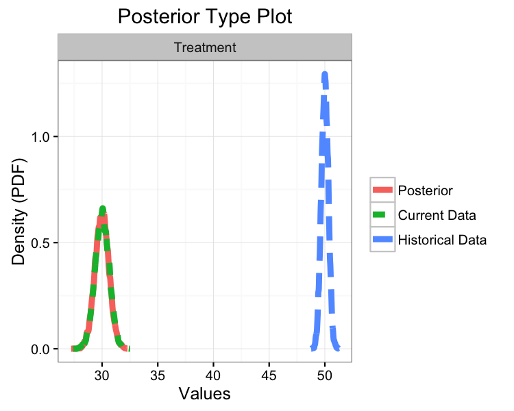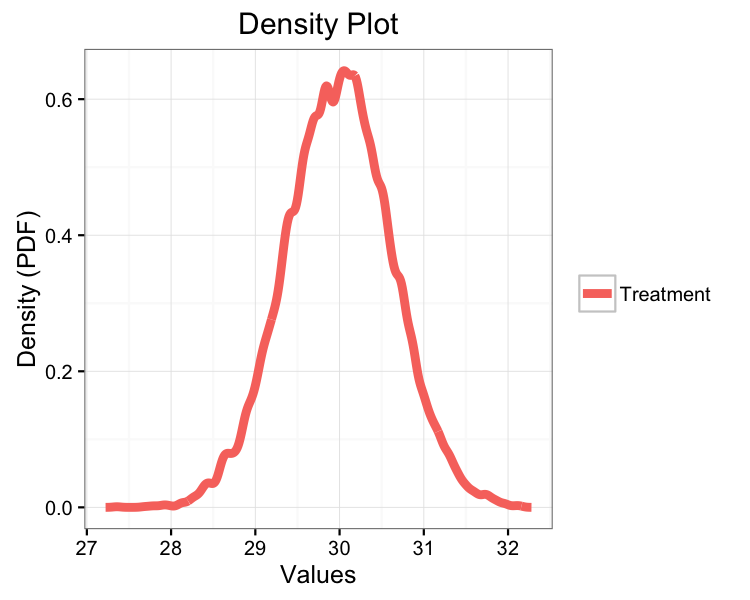

The top plot displays three density curves. The blue curve is the
density of the historical mean, the green curve is the density of the
current mean, and the red curve is the density of the current mean
augmented by historical data. Since little weight was given to the
historical data, the current and posterior means essentially overlap.

The middle plot simply re-displays the posterior mean.

The bottom plot displays the discount function (solid curve) as well as
`alpha` (horizontal dashed line) and `p_hat` (vertical dashed line). In
the present example, the discount function is the Weibull probability
distribution with `shape=3` and `scale=0.135`.

Two-arm trial
-------------

On to two-arm trials. In this package, we define a two-arm trial as an
analysis where a current and/or historical control arm is present.
Suppose we have the same treatment data as in the one-arm example, but
now we introduce control data: `mu_c = 25`, `sigma_c = 10`, `N_c = 250`,
`mu0_c = 25`, `sigma0_c = 5`, and `N0_c = 250`.

Before proceeding, it is worth pointing out that the discount function
is applied separately to the treatment and control data. Now, let's
carry out the two-arm analysis using default inputs:

    set.seed(42)
    fit2 <- bdpnormal(mu_t      = 30,
                      sigma_t   = 10,
                      N_t       = 250, 
                      mu0_t     = 50,
                      sigma0_t  = 5,
                      N0_t      = 250,
                      mu_c      = 25,
                      sigma_c   = 10,
                      N_c       = 250, 
                      mu0_c     = 25,
                      sigma0_c  = 5,
                      N0_c      = 250,
                      fix_alpha = FALSE)
    summary(fit2)

    ## 
    ##     Two-armed bdp normal
    ## 
    ## data:
    ##   Current treatment: mu_t = 30, sigma_t = 10, N_t = 250
    ##   Current control: mu_c = 25, sigma_c = 10, N_c = 250
    ##   Historical treatment: mu0_t = 50, sigma0_t = 5, N0_t = 250
    ##   Historical control: mu0_c = 25, sigma0_c = 5, N0_c = 250
    ## Stochastic comparison (p_hat) - treatment (current vs. historical data): 1
    ## Stochastic comparison (p_hat) - control (current vs. historical data): 0.5065
    ## Discount function value (alpha) - treatment: 0
    ## Discount function value (alpha) - control: 1
    ## alternative hypothesis:  two.sided
    ## 95 percent confidence interval: 
    ##  3.6263  6.3496
    ## augmented sample estimates:
    ## treatment group  control group
    ##           30.00          25.00

The `summary` method of a two-arm analysis is slightly different than a
one-arm analysis. First, we see `p_hat` and `alpha` reported for the
control data. In the present analysis, the current and historical
control data have sample means that are very close, thus the historical
control data is given full weight. Again, little weight is given to the
historical treatment data.

The confidence interval is computed at run time and is the interval
estimate of the difference between the posterior means of the treatment
and control groups. With a 95% confidence interval of
`(3.6263, 6.3496)`, we would conclude that the treatment and control
arms are not significantly different.

The `plot` method of a two-arm analysis is slightly different than a
one-arm analysis as well:

    plot(fit2)

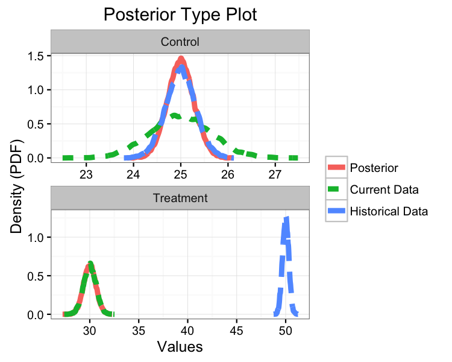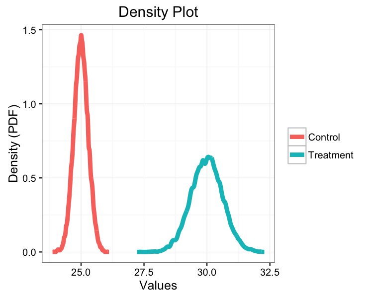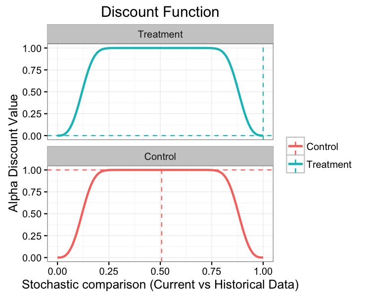
Each of the three plots are analogous to the one-arm analysis, but each
plot now presents additional data related to the control arm.

Introduction
============

The purpose of this vignette is to introduce the `bdpbinomial` function.
`bdpbinomial` is used for estimating posterior samples from a Binomial
event rate outcome for clinical trials where an informative prior is
used. In the parlance of clinical trials, the informative prior is
derived from historical data. The weight given to the historical data is
determined using what we refer to as a discount function. There are
three steps in carrying out estimation:

1.  Estimation of the historical data weight, denoted ,
    via the discount function

2.  Estimation of the posterior distribution of the current data,
    conditional on the historical data weighted by $\\hat{\\alpha}$

3.  If a two-arm clinical trial, estimation of the posterior treatment
    effect, i.e., treatment versus control

Throughout this vignette, we use the terms `current`, `historical`,
`treatment`, and `control`. These terms are used because the model was
envisioned in the context of clinical trials where historical data may
be present. Because of this terminology, there are 4 potential sources
of data:

1.  Current treatment data: treatment data from a current study

2.  Current control data: control (or other treatment) data from a
    current study

3.  Historical control data: treatment data from a previous study

4.  Historical control data: control (or other treatment) data from a
    previous study

If only treatment data is input, the function considers the analysis a
one-arm trial. If treatment data + control data is input, then it is
considered a two-arm trial.

Estimation of the historical data weight
----------------------------------------

In the first estimation step, the historical data weight
 is estimated. In the case of a two-arm trial, where
both treatment and control data are available, an  value
is estimated separately for each of the treatment and control arms. Of
course, historical treatment or historical control data must be present,
otherwise  is not estimated for the corresponding arm.

When historical data are available, estimation of  is
carried out as follows. Let *y* and *N* denote the number of events and
sample size of the current data, respectively. Similarly, let
*y*0 and *N*0 denote the number of events and
sample size of the historical data, respectively. Let *a*0
and *b*0 denote the rate parameters of a Beta distribution.
Then, the posterior distributions of the event rates for current and
historical data, under vague (flat) priors are

 and

*θ*0 ∼ ℬ*e**t**a*(*y*0+*a*0, *N*0−*y*0+*b*0),
 respectively. We next compute the posterior probability
. Finally, for a
Weibull distribution function (i.e., the Weibull cumulative distribution
function), denoted *W*,  is computed as

 where *w**s**h**a**p**e* and *w**s**c**a**l**e*
are the shape and scale of the Weibull distribution function,
respectively.

There are several model inputs at this first stage. First, the user can
select `fix_alpha=TRUE` and force a fixed value of  (at
the `alpha_max` input), as opposed to estimation via the discount
function. Next, a Markov Chain Monte Carlo approach is used, requiring
several samples from the posterior distributions. Thus, the user can
input a sample size greater than or less than the default value of
`number_mcmc=10000`. Next, the Beta rate parameters can be changed from
the defaults of *a*0 = *b*0 = 1 (`a0` and `b0`
inputs). Finally, the shape of the Weibull discount function can be
altered by changing the Weibull shape and scale parameters from the
default values of *w**s**h**a**p**e* = 3 and
*w**s**c**a**l**e* = 0.135 (`weibull_shape` and
`weibull_scale` inputs).

With the historical data weight  in hand, we can move on
to estimation of the posterior distribution of the current data.

### Discount function

Throughout this vignette, we refer to a discount function. The discount
function is a Weibull distribution function and has the form
*W*(*x*)=1 − exp{−(*x*/*w**s**c**a**l**e*)*w**s**h**a**p**e*}.
 During estimation, a user may be interested in selecting values of
*w**s**h**a**p**e* and *w**s**c**a**l**e* that
result in optimal statistical properties of the analysis. Thus, the
discount function can be used to control the false positive rate (type I
error) and/or the false negative rate (type II error). Examples in a
following section illustrate the shape of the discount function using
the default shape and scale parameters.

Another important aspect related to the discount function is the
analysis type: one-sided or two-sided. The sidedness of the analysis is
analogous to a one- or two-sided hypothesis test. Using the default
shape and scale inputs, a **two-sided** analysis type results in a
discount function with the following curve:
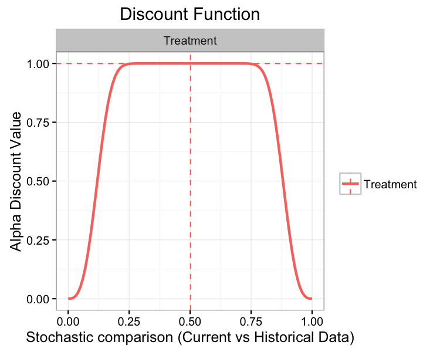

The discount function of a **one-sided** analysis, again with the
default shape and scale inputs, has the following curve:
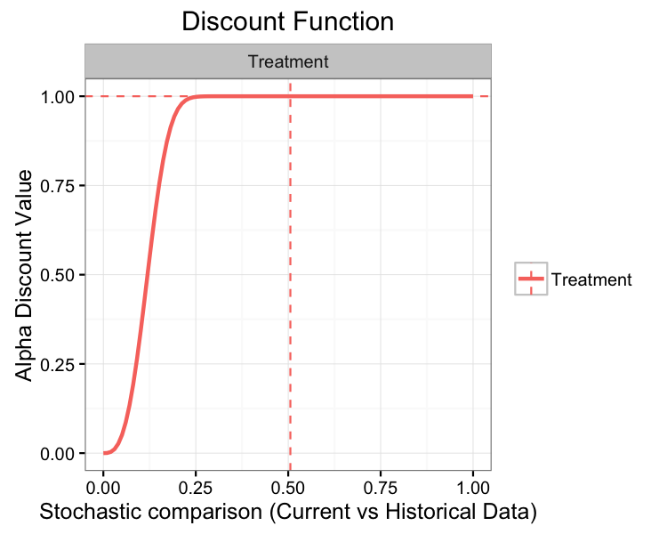

In both of the above plots, the x-axis is the stochastic comparison
between current and historical data, which we've denoted *p*. The y-axis
is the discount value  that corresponds to a given value
of *p*.

Estimation of the posterior distribution of the current data, conditional on the historical data
------------------------------------------------------------------------------------------------

With  in hand, we can now estimate the posterior
distribution of the current data event rate. Using the notation of the
previous section, the posterior distribution is

 At this model stage, we have in hand `number_mcmc` simulations from the
augmented event rate distribution. If there are no control data, i.e., a
one-arm trial, then the modeling stops and we generate summaries of the
posterior distribution of *θ*. Otherwise, if there are control data, we
proceed to a third step and compute a comparison between treatment and
control data.

Estimation of the posterior treatment effect: treatment versus control
----------------------------------------------------------------------

This step of the model is carried out on-the-fly using the `summary` or
`print` methods. Let *θ**T* and *θ**C* denote
posterior event rate estimates of the treatment and control arms,
respectively. Currently, the implemented comparison between treatment
and control is the difference, i.e., summary statistics related to the
posterior difference: *θ**T* − *θ**C*. In a future
release, we may consider implementing additional comparison types.

Function inputs
---------------

The data inputs for `bdpbinomial` are `y_t`, `N_t`, `y0_t`, `N0_t`,
`y_c`, `N_c`, `y0_c`, and `N0_c`. The data must be input as (`y`, `N`)
pairs. For example, `y_t`, the number of events in the current treatment
group, must be accompanied by `N_t`, the sample size of the current
treatment group. Historical data inputs are not necessary, but using
this function would not be necessary either.

**At the minimum, `y_t` and `N_t` must be input**. In the case that only
`y_t` and `N_t` are input, the analysis is analogous to using
`prop.test`. Each of the following input combinations are allowed:

-   (`y_t`, `N_t`) - one-arm trial
-   (`y_t`, `N_t`) + (`y0_t`, `N0_t`) - one-arm trial
-   (`y_t`, `N_t`) + (`y_c`, `N_c`) - two-arm trial
-   (`y_t`, `N_t`) + (`y0_c`, `N0_c`) - two-arm trial
-   (`y_t`, `N_t`) + (`y0_t`, `N0_t`) + (`y_c`, `N_c`) - two-arm trial
-   (`y_t`, `N_t`) + (`y0_t`, `N0_t`) + (`y0_c`, `N0_c`) - two-arm trial
-   (`y_t`, `N_t`) + (`y0_t`, `N0_t`) + (`y_c`, `N_c`) + (`y0_c`,
    `N0_c`) - two-arm trial

Examples
========

One-arm trial
-------------

Suppose we have historical data with `y0_t=25` events out of a sample
size of `N0_t=250` patients. This gives a historical event rate of 0.1.
Now, suppose we have current data with `y_t=10` events out of a sample
size of `N_t=200` patients, giving an event rate of 0.05. To illustrate
the approach, let's first give full weight to the historical data. This
is accomplished by setting `alpha_max=1` and `fix_alpha=TRUE` as
follows:

    set.seed(42)
    fit1 <- bdpbinomial(y_t       = 10,
                        N_t       = 200,
                        y0_t      = 25,
                        N0_t      = 250,
                        alpha_max = 1,
                        fix_alpha = TRUE)
    summary(fit1)

    ## 
    ##     One-armed bdp binomial
    ## 
    ## Current treatment data: 10 and 200
    ## Historical treatment data: 25 and 250
    ## Stochastic comparison (p_hat) - treatment (current vs. historical data): 0.9753
    ## Discount function value (alpha) - treatment: 1
    ## 95 percent confidence interval: 
    ##  0.0568  0.1068
    ## augmented sample estimate:
    ## probability of success
    ##  0.0792

Based on the `summary` output of `fit1`, we can see that the value of
`alpha` was held fixed at 1. The resulting (augmented) event rate was
estimated at 0.0792 which is approximately the event rate if we combined
the historical and current data together, i.e.,
`(10 + 25) / (200 + 250) = 0.078`. Note that the `print` and `summary`
methods result in the same output.

Now, let's relax the constraint on fixing `alpha` at 1. We'll also take
this opportunity to describe the output of the plot method.

    set.seed(42)
    fit1a <- bdpbinomial(y_t       = 10,
                         N_t       = 200,
                         y0_t      = 25,
                         N0_t      = 250,
                         alpha_max = 1,
                         fix_alpha = FALSE)
    summary(fit1a)

    ## 
    ##     One-armed bdp binomial
    ## 
    ## Current treatment data: 10 and 200
    ## Historical treatment data: 25 and 250
    ## Stochastic comparison (p_hat) - treatment (current vs. historical data): 0.9753
    ## Discount function value (alpha) - treatment: 0.0061
    ## 95 percent confidence interval: 
    ##  0.0282  0.0901
    ## augmented sample estimate:
    ## probability of success
    ##  0.0535

When `alpha` is not constrained to one, it is estimated based on a
comparison between the current and historical data. We see that the
stochastic comparison, `p_hat`, between historical and control is
0.9762. Here, `p_hat` is the posterior probability that the current
event rate is less than the historical event rate under vague priors.
With the present example, `p_hat = 0.9762` implies that the current and
historical event rates are very different. The result is that the weight
given to the historical data is shrunk towards zero. Thus, the estimate
of `alpha` from the discount function is 0.0061, essentially zero, and
the augmented posterior estimate of the event rate is approximately the
event rate of 0.05 observed in the current data.

Many of the the values presented in the `summary` method are accessible
from the fit object. For instance, `alpha` is found in
`fit1aalpha_discount` and `p_hat` is located at
`fit1ap_hat`. The augmented probability of success
and confidence interval are computed at run-time. The results can be
replicated as:

    mean_augmented <- round(median(fit1a$posterior_treatment$posterior),4)
    CI95_augmented <- round(quantile(fit1a$posterior_treatment$posterior, prob=c(0.025, 0.975)),4)

Finally, we'll explore the `plot` method.

    plot(fit1a)

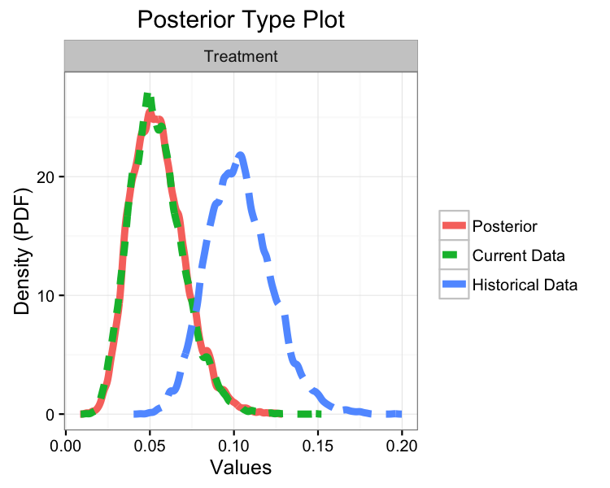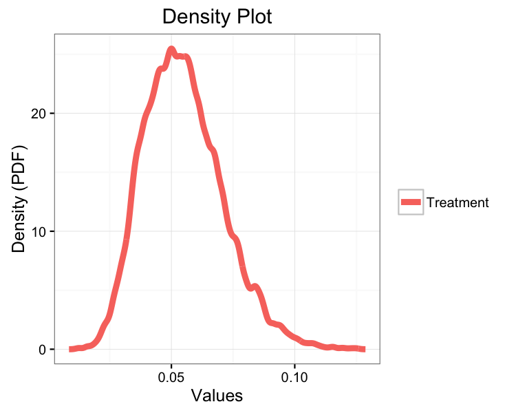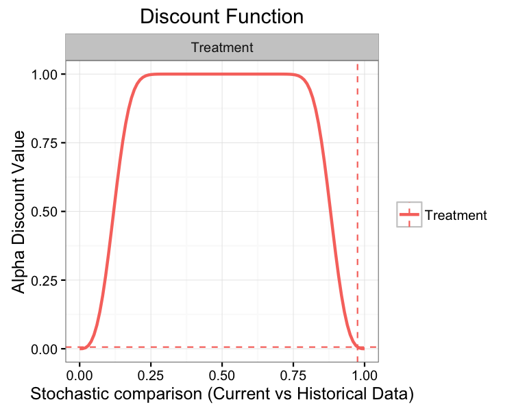

The top plot displays three density curves. The blue curve is the
density of the historical event rate, the green curve is the density of
the current event rate, and the red curve is the density of the current
event rate augmented by historical data. Since little weight was given
to the historical data, the current and posterior event rates
essentially overlap.

The middle plot simply re-displays the posterior event rate.

The bottom plot displays the discount function (solid curve) as well as
`alpha` (horizontal dashed line) and `p_hat` (vertical dashed line). In
the present example, the discount function is the Weibull probability
distribution with `shape=3` and `scale=0.135`.

Two-arm trial
-------------

On to two-arm trials. In this package, we define a two-arm trial as an
analysis where a current and/or historical control arm is present.
Suppose we have the same treatment data as in the one-arm example, but
now we introduce control data: `y_c = 15`, `N_c = 200`, `y0_c = 20`, and
`N0_c = 250`. This control data gives a current event rate of
`15/200 = 0.075` and a historical event rate of `20/250 = 0.08`.

Before proceeding, it is worth pointing out that the discount function
is applied separately to the treatment and control data. Now, let's
carry out the two-arm analysis using default inputs:

    set.seed(42)
    fit2 <- bdpbinomial(y_t  = 10,
                        N_t  = 200,
                        y0_t = 25,
                        N0_t = 250,
                        y_c  = 15,
                        N_c  = 200,
                        y0_c = 20,
                        N0_c = 250)
    summary(fit2)

    ## 
    ##     Two-armed bdp binomial
    ## 
    ## Current treatment data: 10 and 200
    ## Current control data: 15 and 200
    ## Historical treatment data: 25 and 250
    ## Historical control data: 20 and 250
    ## Stochastic comparison (p_hat) - treatment (current vs. historical data): 0.9753
    ## Stochastic comparison (p_hat) - control (current vs. historical data): 0.5715
    ## Discount function value (alpha) - treatment: 0.0061
    ## Discount function value (alpha) - control: 1
    ## alternative hypothesis:  two.sided
    ## 95 percent confidence interval:
    ##   -0.0628 0.0161
    ## augmented sample estimates:
    ## prop 1 prop2
    ##   0.05  0.08

The `summary` method of a two-arm analysis is slightly different than a
one-arm analysis. First, we see `p_hat` and `alpha` reported for the
control data. In the present analysis, the current and historical
control data have event rates that are very close, thus the historical
control data is given full weight. This implies that the (augmented)
posterior control event rate is approximately
`(15 + 20)/(200 + 250) = 0.08`. Again, little weight is given to the
historical treatment data, so we have an (augmented) posterior treatment
event rate of approximately 0.05.

The confidence interval is computed at run time and is the interval
estimate of the difference between the posterior treatment and control
event rates. With a 95% confidence interval of `(-0.0628, 0.0161)`, we
would conclude that the treatment and control arms are not significantly
different.

The `plot` method of a two-arm analysis is slightly different than a
one-arm analysis as well:

    plot(fit2)

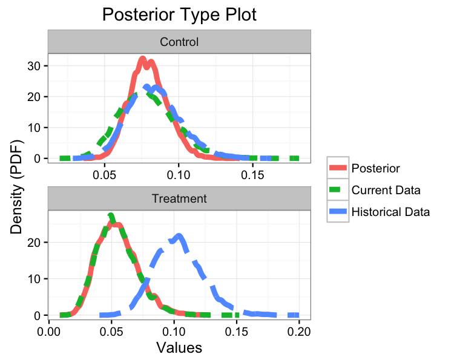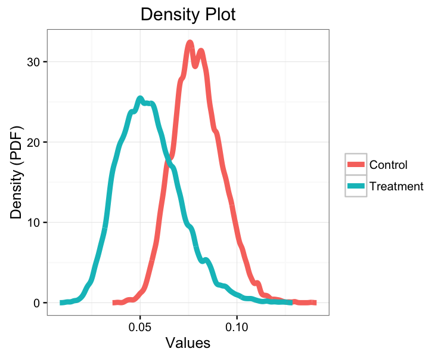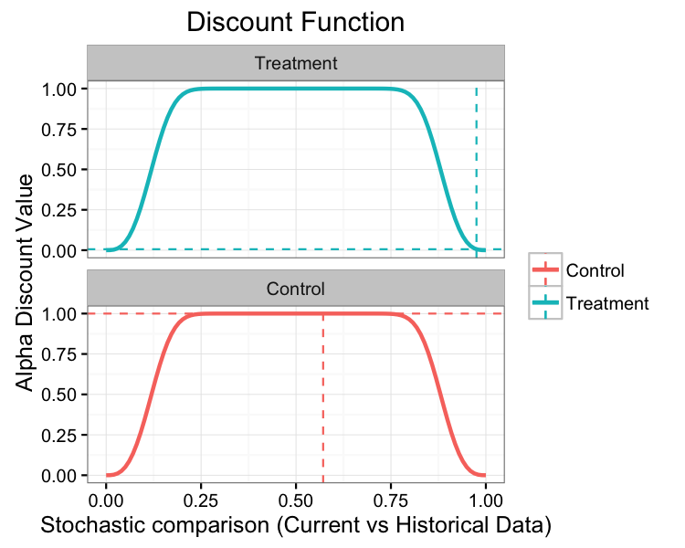
Each of the three plots are analogous to the one-arm analysis, but each
plot now presents additional data related to the control arm.

### Authors

Shawn Balcome, Donnie Musgrove, Tarek Haddad and Christopher Jackson
(For the ppexp R code that was ported to C++.)

### License

GPL (&gt;= 3)

:apple: :tangerine: :lemon: :cherries:
[:watermelon:](http://codeology.braintreepayments.com/balcomes/bayesdp#)
:strawberry: :peach: :pear: :green\_apple:
